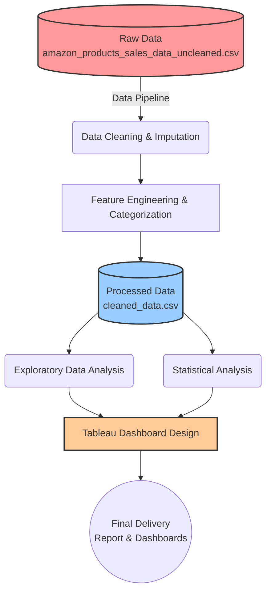

<div align="center">
  
</div>

# Amazon Electronics Market Intelligence (DVA Capstone)


Welcome to the **Data Visualization and Analytics (DVA) Capstone Project** repository. This project provides an end-to-end data pipeline and visual analytics solution for Amazon Electronics sales data. It processes raw product data, extracts meaningful insights through exploratory and statistical analysis, and presents the findings in an interactive Tableau dashboard.

## 📊 Tableau Dashboard

The final deliverable of this project is an interactive Tableau dashboard that provides market intelligence on Amazon Electronics.

- **Main Dashboard & Executive Summary**: [Amazon Electronics Market Intelligence Dashboard](https://public.tableau.com/views/AmazonElectronicsMarketIntelligenceDashboard/Dashboard4?:language=en-GB&:sid=&:redirect=auth&:display_count=n&:origin=viz_share_link)

## 📁 Repository Structure

```text
E_G1_DVACapstone2/
├── data/
│   ├── raw/                 # Contains the initial scraped dataset (amazon_products_sales_data_uncleaned.csv)
│   └── processed/           # Contains the cleaned dataset ready for analysis (cleaned_data.csv)
├── docs/                    # Documentation
│   └── data_dictionary.md   # Schema definition, business rules, and data quality notes
├── notebooks/               # Jupyter notebooks for step-by-step analysis
│   ├── 01_extraction.ipynb
│   ├── 02_cleaning.ipynb
│   ├── 03_eda.ipynb
│   ├── 04_statistical_analysis.ipynb
│   └── 05_final_load_prep.ipynb
├── reports/                 # Final deliverables
│   ├── presentation.pdf     # Presentation slides
│   └── project_report.pdf   # Detailed project report
├── scripts/                 # Source code for data pipelines
│   └── etl_pipeline.py      # Automated ETL script for data cleaning and feature engineering
└── tableau/                 # Tableau resources
    ├── dashboard_links.md   # Links to published dashboards
    └── screenshots/         # Screenshots of the interactive dashboards
```

## 🔄 Project Workflow



## ⚙️ Data Pipeline (ETL)

The core data processing is handled by the `scripts/etl_pipeline.py` script. It implements the `AmazonDataCleaner` class which performs:

1. **Data Cleaning**: Removes duplicates, parses numerical values from text (e.g., extracting ratings like "4.6 out of 5 stars"), and formats the `number_of_reviews` and `bought_in_last_month` columns.
2. **Price Processing**: Resolves and imputes `listed_price` and `current_price`. Filters out invalid outliers (e.g., negative prices or items > $50,000).
3. **Feature Engineering**: Derives robust binary flags for analytical use, such as `is_best_seller`, `is_sponsored`, `has_coupon`, and `is_sustainable`.
4. **Category Derivation**: Uses a strictly ordered keyword-based matching engine to accurately classify products into categories like *Microphones*, *Laptops & Computers*, *Headphones & Earbuds*, etc.
5. **Null Imputation**: Safely replaces remaining null values in string columns (`buy_box_availability`, `delivery_details`, `product_url`) with semantic fallbacks for accurate downstream reporting.

To run the pipeline locally:
```bash
python scripts/etl_pipeline.py
```
This will process `data/raw/amazon_products_sales_data_uncleaned.csv` and output the cleaned version to `data/processed/cleaned_data.csv`.

## 📓 Analysis Workflow

The `notebooks/` directory contains the chronological steps taken during the analytical phase of this project:
- **`01_extraction.ipynb`**: Initial data exploration and understanding.
- **`02_cleaning.ipynb`**: Prototyping data cleaning steps (later automated in `etl_pipeline.py`).
- **`03_eda.ipynb`**: Exploratory Data Analysis (EDA) uncovering key distributions, trends, and correlations in pricing and reviews.
- **`04_statistical_analysis.ipynb`**: In-depth statistical testing and significance evaluation.
- **`05_final_load_prep.ipynb`**: Final preparations and validations before loading the data into Tableau.

## 📚 Documentation

For a detailed breakdown of the features, data types, and transformation rules applied to the dataset, please refer to the [Data Dictionary](docs/data_dictionary.md). For detailed findings, refer to the `project_report.pdf` in the `reports/` folder.
